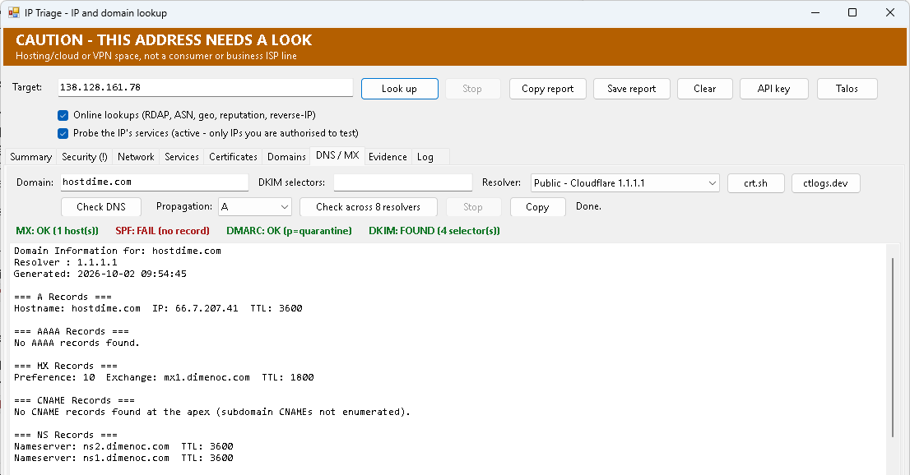

# IP Triage

A WinForms tool for **Windows PowerShell 5.1** that identifies a public IP or a domain: **who owns the network, which business is associated with it**, and **what services answer on it**. Feed it an address from an alert, a log, a firewall entry or a mail header.

Built for MSP triage: sort an address into *one of our customers*, *our own range*, or *an outside source*, without pasting it into a third-party web tool.

From [ihavenoram.com](https://ihavenoram.com): field notes for ADHD techs running managed services.



## Download

Grab the latest zip from **[Releases](../../releases/latest)**. The SHA-256 checksum is in the release notes and in the `.sha256` file beside the zip:

```powershell
Get-FileHash .\IP-Triage.zip -Algorithm SHA256
```

## Run it

Double-click **`Launch-IP-Triage.cmd`** (it launches PowerShell with `-STA`, which WinForms needs). No admin required.

Type or paste the target and click **Look up** (or press Enter). It accepts:

- an IP, an `ip:port`, a URL, or a whole pasted alert line (it finds the address)
- a **hostname**: it resolves the name and triages the address behind it, keeps the name in the box, shows `host -> address` beside it, and includes the name in the Domains tab

If the clipboard holds a literal IP when the tool opens, it prefills the box and pre-selects the text so typing replaces it. **Clear** empties the box, and `-NoClipboard` disables the prefill.

## What it does

**Passive by default** (all keyless; nothing is sent to a login-bearing service):

- Reverse DNS (PTR), with generic ISP-style names flagged as low value
- ASN and network prefix (Team Cymru, over DNS)
- RDAP network record: netname, range, and the org/abuse contacts
- Geolocation and ISP/org (ipinfo.io, tokenless)
- Shodan **InternetDB**: ports, hostnames and software already collected passively
- Tor exit-node check
- Reverse-IP: other domains hosted on the address (HackerTarget, ~50/day free)
- Domain registration for the names found, **organisation-level only** (registrar, registrant org, status, dates, name servers). Individual contact names, emails, phones and addresses are deliberately dropped. Uses RDAP first, then port-43 WHOIS for TLDs where RDAP returns only the registrar.

**Active probing is opt-in** (tick *"Probe the IP's services"*, then confirm). **Only probe IPs you own or are authorised to test.** It's read-only: it opens a TCP connection to a fixed set of common service ports, reads the banner, HTTP headers and TLS certificate the service already presents, and closes. No credentials, no UDP, no exploit checks.

## Risk and exposure

**A bad address is meant to be unmissable.** When the risk comes out Medium or High, a coloured banner appears across the top of the window: orange *CAUTION*, or red *MALICIOUS IP - DO NOT TRUST THIS ADDRESS* when AbuseIPDB confidence is 50% or more (or it's a Tor exit). It quotes the score, the report counts and **what the address is reported for** (e.g. Fraud VoIP, Brute-Force, Port Scan). The Security tab is marked `(!)`, and clicking the banner jumps to the detail. The same warning is written into the report. Low-risk lookups show no banner at all, because a warning on every lookup just trains people to ignore it.

The Summary separates two questions:

- **Risk**: is the address itself suspect? Rated `Low / Medium / High` from the Tor exit listing, AbuseIPDB confidence (when a key is set), a country outside your expected set (when you've set one), and hosting/cloud/VPN space rather than an ISP line. Every reason is printed, so the rating can be argued with.
- **Notes / exposure**: is the thing behind the address badly configured? Open RDP/SMB/Telnet/PPTP, end-of-life software, self-signed or expired certificates, obsolete TLS, and any known CVEs Shodan reports against the host.

## Make it yours

**Known ranges.** `KnownRanges.csv` beside the script (`Range,Label,Type`, where Range is CIDR or a single address and Type is `Ours` or `Customer`) is checked *before* any online lookup, so "is this one of ours?" is answered instantly and offline. The file ships with commented examples only.

**Expected countries are off by default.** The country is always shown, but nothing is judged foreign until you say where your traffic normally comes from:

```bat
Launch-IP-Triage.cmd -ExpectedCountries "GB,IE"
```

Registry country (RDAP/Cymru) is preferred over the geolocation guess. Where the two disagree but geolocation still lands in an expected country (normal for AWS/Azure regions registered to a US head office), it's reported as a note and does *not* count as foreign.

**AbuseIPDB is optional.** With no key the check is skipped and the report says so. Click **API key** to paste one in: the dialog can **Test** it (a lookup of `8.8.8.8`), **Save** it or **Remove** it. The key is stored DPAPI-encrypted in `%APPDATA%\IP-Triage\config.json`, readable only by your Windows account on that PC, and never beside the script. `ABUSEIPDB_KEY` in the environment overrides the saved key.

**No DNS blocklists**, on purpose: some public blocklists refuse queries from shared public resolvers and answer with an error code, which a naive check would report as "clean".

## DNS / MX tab

An on-demand domain checker. It reports A/AAAA/MX/CNAME/NS/TXT/SOA, validates SPF recursively against the RFC 7208 ten-lookup limit, checks DMARC, and probes DKIM with selectors derived from the SPF record. Results are summarised in a coloured strip (`MX: OK`, `SPF: OK`, `DMARC: WARN (p=none)`, `DKIM: FOUND`) above the full report. Extra DKIM selectors can be supplied for providers that use account-specific ones.

**It queries a public resolver (Cloudflare) by default, and that matters.** Run from inside a customer network, the PC's DNS usually answers from an internal AD zone of the same name, which typically has no MX or TXT records, so the report would claim SPF, DMARC and MX are missing when they're published perfectly well. The tab compares the two views and raises `Split-horizon: WARN` when they disagree. Pick `This PC's DNS (internal view)` when you specifically want the internal answer.

**Propagation** checks one record type across 8 public resolvers.

## Second opinions in the browser

| Button | Where | Opens |
|---|---|---|
| **Talos** | main toolbar, uses the IP | Cisco Talos reputation centre |
| **crt.sh** | DNS / MX tab, uses the domain | crt.sh certificate-transparency search |
| **ctlogs.dev** | DNS / MX tab, uses the domain | ctlogs.dev CT log search |

Each validates that the value is address-shaped and URL-encodes it first. The CT log searches are the quickest way to list every subdomain a certificate was ever issued for.

## Files

| File | Purpose |
|---|---|
| `Launch-IP-Triage.cmd` | Launcher (forces `-STA`) |
| `IP-Triage.ps1` | The GUI, worker and renderers |
| `IP-Triage.Helpers.ps1` | Lookup, parse and fingerprint functions |
| `IP-Triage.Dns.ps1` | DNS and mail-security checks for the DNS / MX tab |
| `KnownRanges.csv` | Your own and customer ranges (examples only, commented out) |
| `examples\Get-DomainDNSInfo.ps1` | The original console script the DNS tab grew from |

## Notes

- Windows PowerShell 5.1 only. Scripts are ASCII + UTF-8 BOM.
- Lookups run in a background runspace so the window stays responsive; **Stop** cancels between stages.
- Shodan InternetDB's terms for commercial use aren't confirmed here; it sits behind the *Online lookups* toggle. Turn that off to skip all HTTP-based sources and use DNS only (PTR + ASN).

## About

Built with AI assistance (Claude) for real MSP triage work. It's provided as is, with no warranty. Probing sends real connections, so check how your EDR and your customers' monitoring will react first.

MIT licensed; see [LICENSE](LICENSE).
